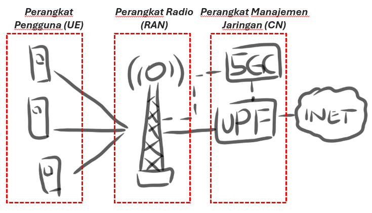

"Rock Bottom" Sistem Telekomunikasi 5G
=======================================
**Garis Putih Teknologi**

*Tokyo, 3 Juni 2024*

Membaca kalimat sistem telekomunikasi mungkin membuat beberapa GPT-ID cemas dan ketar-ketir duluan. Kalimat yang sangat identik dengan sistem yang rumit dan teknologi yang kompleks ini menjadi momok menakutkan bagi beberapa rekan, bahkan penulis sendiri. Masih teringat jelas ketika enulis ketika menempuh studi sarjana dahulu, mata kuliah Dasar Sistem Telekomunikasi menjadi mata kuliah yang paling banyak "meninggal-kelaskan" mahasiswa dan menjadi satu mata kuliah wajib yang -kalau bisa- lulus saja sudah cukup. Penulis juga ingat ketika kami mahasiswa berbondong-bondong untuk mengambil kelas yang dosennya sangat dermawan memberikan nilai, sehingga kelas tersebut ditutup karena *over capacity*. Pada topik pendahuluan ini, penulis ingin memberikan sedikit dan sekilas gambaran bagaimana arsitektur sistem telekomunikasi 5G secara garis besar.

Selayang Pandang Sistem 5G
--------------------------
Pada sistem telekomunikasi 5G, ada tiga komponen pembentuk yang perlu GPT-ID pahami, perangkat pengguna atau yang bisa disebut sebagai *User Equipment* (UE), perangkat radio atau *Radio Access Network* (RAN), dan perangkat manajemen jaringan atau *Core Network* (CN). Ketiga komponen ini memiliki fungsinya masing-masing dan menjadi komponen utama dalam membentuk satu kesatuan arsitektur sistem telekomunikasi 5G. Secara garis besar arsitektur sistem 5G tergambar pada Gambar 1 dibawah ini.

.. class:: center
  Gambar 1. Arsitektur Sistem Telekomunikasi 5G
